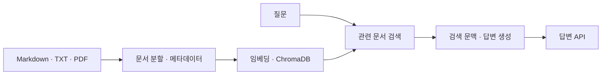

# CSFriends RAG Chatbot


CSFriends는 CS 면접 및 기술 문서 데이터를 기반으로 답변하는 RAG 챗봇 프로젝트입니다. 기존 Frontend 디자인은 유지하고, FastAPI Backend에서 문서 재귀 탐색, 청킹, 임베딩, ChromaDB 검색, OpenAI 응답 생성을 담당합니다.

## 해결한 문제와 개인 기여

CS 면접·기술 문서를 하위 폴더까지 읽고, 질문과 관련된 문서를 찾아 답변 생성에 연결하는 백엔드를 구현했습니다. 기존 스켈레톤 챗봇을 확장한 프로젝트입니다.

**서현식(Crew-97) · Backend**

| 담당 범위 | 구현한 내용 | 코드·기록 |
|---|---|---|
| 문서 처리 | Markdown 제목별 분할, 하위 폴더 재귀 탐색, 출처·분류·제목 메타데이터 저장 | [백엔드 구현](./servers/main.py) |
| 검색·답변 | 문서 임베딩과 ChromaDB 검색, 검색 문맥을 활용하는 FastAPI 답변 API | [백엔드 최종 변경](https://github.com/Crew-97/CSFriends/commit/b9b7acc) |
| 문서 추가·화면 연결 | 업로드 문서의 즉시 인덱싱, 통합 API 호출과 중복 전송 방지 연결 | [연결 변경](https://github.com/Crew-97/CSFriends/commit/354883f), [수행 기록](./REPORT.md) |

프론트 디자인·후속 UI 변경은 팀원 기여와 구분합니다. 외부 임베딩 모델과 OpenAI 모델을 사용했으며, 자체 모델 학습 경험을 뜻하지 않습니다.

## 요청이 처리되는 흐름



관련도 기준에 맞는 문서가 없으면 일반 답변으로 전환합니다. API의 `used_rag`와 `sources`로 검색 문서 사용 여부를 구분할 수 있습니다.

## 기술 스택

- Frontend: HTML, CSS, JavaScript
- Backend: FastAPI, Uvicorn
- LLM: OpenAI Chat Completions API
- Embedding: SentenceTransformer `jhgan/ko-sroberta-multitask`
- Vector DB: ChromaDB persistent mode
- Document parsing: Markdown, TXT, PDF(`pypdf`)
- Environment: `python-dotenv`

## 프로젝트 구조

```text
PJT_01_Chatbot/
├─ .env.example
├─ .gitignore
├─ README.md
├─ REPORT.md
├─ docs/
│  ├─ screenshots/
│  ├─ architecture/
│  └─ sample-questions/
├─ index.html
├─ script.js
├─ style.css
└─ servers/
   ├─ main.py
   ├─ requirements.txt
   ├─ data/
   └─ chroma_data/
```

## 설치 및 실행

```bash
cd servers
python -m venv .venv
```

Windows PowerShell:

```powershell
.\.venv\Scripts\Activate.ps1
pip install -r requirements.txt
$env:OPENAI_API_KEY="sk-..."
python main.py
```

macOS/Linux:

```bash
source .venv/bin/activate
pip install -r requirements.txt
export OPENAI_API_KEY="sk-..."
python main.py
```

## .env 사용 방법

아래 작업은 `servers` 폴더가 아닌 **저장소 루트**에서 진행합니다. 기존 `.env`가 있다면 보존하고 필요한 값만 확인합니다.

```text
OPENAI_API_KEY=sk-...
```

또는 예시 파일을 복사해서 사용할 수 있습니다.

```powershell
if (-not (Test-Path .env)) { Copy-Item .env.example .env }
```

`.env.example`에는 실제 키를 넣지 않습니다.

```text
OPENAI_API_KEY=your_openai_api_key_here
```

보안상 `.env` 파일은 GitHub에 업로드하면 안 됩니다. 이 프로젝트의 `.gitignore`에는 `.env`가 포함되어 있어 실제 API 키가 커밋되지 않도록 구성되어 있습니다.

## 서버 접속

서버 실행 후 API 문서는 아래 주소에서 확인합니다.

```text
http://localhost:8000/docs
```

Frontend는 프로젝트 루트의 `index.html`을 브라우저에서 열어 사용할 수 있습니다.

## RAG 동작 방식

1. 서버 시작 시 `servers/data`를 `os.walk()`로 재귀 탐색합니다.
2. `.md`, `.txt`, `.pdf` 파일만 읽고 빈 파일과 깨진 PDF는 skip합니다.
3. Markdown은 `#`, `##`, `###` 제목 기준으로 section을 분리합니다.
4. 긴 section은 `CHUNK_SIZE`, `CHUNK_OVERLAP` 기준으로 추가 청킹합니다.
5. 각 chunk에 `source`, `category`, `section`, `chunk_index` metadata를 저장합니다.
6. SentenceTransformer로 임베딩한 뒤 ChromaDB persistent collection에 저장합니다.
7. `/integrated-chat` 요청 시 벡터 검색 결과를 context로 OpenAI 모델에 전달합니다.

## data 폴더

`servers/data`는 CS 면접/기술 문서의 원천 데이터 폴더입니다. 하위 폴더를 자유롭게 구성할 수 있으며 서버는 모든 하위 폴더를 재귀 탐색합니다.

예시 metadata:

```json
{
  "source": "02-backend-engineering/database/indexing.md",
  "category": "02-backend-engineering",
  "section": "B-Tree Index"
}
```

## chroma_data 폴더

`servers/chroma_data`는 ChromaDB 영속 저장소입니다. 폴더가 없으면 서버 시작 시 자동 생성됩니다. 현재 구현은 서버 시작 시 컬렉션을 재생성해 `data` 폴더의 최신 상태와 검색 DB를 일치시킵니다.

## 주요 API

- `POST /chat`: 일반 OpenAI 챗봇 응답
- `POST /search?top_k=5`: 벡터 검색 결과와 similarity score 반환
- `POST /integrated-chat?top_k=5&debug=false`: RAG 기반 메인 챗봇 응답
- `POST /upload`: `.md`, `.txt`, `.pdf` 문서 업로드 및 즉시 인덱싱

`/integrated-chat` 응답 예시:

```json
{
  "answer": "참고 문서 기반 답변입니다. ...",
  "used_rag": true,
  "sources": ["02-backend-engineering/database/indexing.md"]
}
```

## 예시 질문

- 프로세스와 스레드의 차이를 면접 답변처럼 설명해줘.
- TCP 3-way handshake 과정을 설명해줘.
- B-Tree 인덱스가 데이터베이스 조회 성능을 높이는 이유는?
- 싱글톤 패턴의 장점과 단점은?
- JWT 인증 방식의 장점과 주의할 점은?

## 확인된 범위와 남은 개선

- 문서 분할·검색·업로드 API는 구현돼 있습니다. 현재 프론트는 답변 본문을 표시하며, 출처와 문서 사용 여부의 화면 표시는 보완 대상입니다. 업로드 API와 업로드 화면 제공도 구분합니다.
- 같은 파일명의 변경 문서를 재업로드하면 이전 조각이 남을 수 있습니다. 서버 재시작 시 컬렉션을 재생성하는 동작과 실행 중 문서 갱신 처리는 다릅니다.
- 검색 문맥 길이를 제한할 때 반환 출처 목록에 문맥에서 제외된 문서가 포함될 수 있어, 실제 사용 문서만 반환하도록 보완이 필요합니다.
- 2026-09-10 검토에서는 코드·분할 로직과 모의 객체를 사용한 갱신·출처 사례를 확인했습니다. 실제 모델 다운로드·OpenAI 호출·전체 서버 실행을 재검증하지 않았습니다.
- 검색 정확도·응답 속도·사용자 규모의 측정 결과는 확보하지 않았습니다. 청킹 길이·유사도 기준 변경을 정량 성능 향상으로 제시하지 않습니다.

## 실행 화면 캡처 위치

제출용 실행 화면은 `docs/screenshots/` 폴더에 저장합니다. 예: `docs/screenshots/chat-result.png`, `docs/screenshots/search-api.png`
