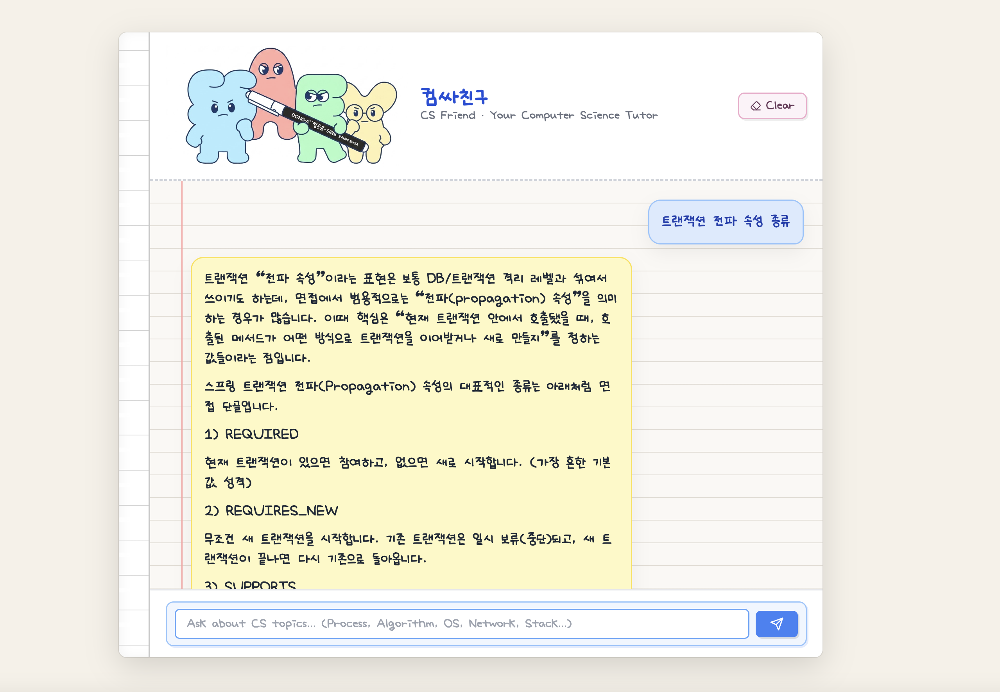
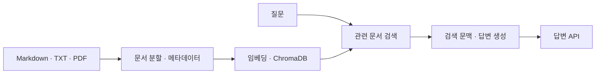

# CSFriends · RAG 챗봇

CS 면접·기술 문서에서 질문과 관련된 내용을 찾아 답변에 연결하는 챗봇입니다. 기존 스켈레톤을 확장해 **FastAPI 백엔드의 문서 처리·검색·답변 생성·업로드 흐름**을 구현했습니다.

**서현식(Crew-97) · 백엔드**

[개인 기여](#개인-기여) · [동작 구조](#동작-구조) · [실행 방법](#실행-방법) · [구현-검증 범위](#구현검증-범위) · [포트폴리오](https://dorian-insect-dbd.notion.site/3d7f9416d0c981e09550c74daf722192) · [GitHub 프로필](https://github.com/Crew-97)

## 개인 기여

| 담당 범위 | 구현한 내용 | 근거 |
|---|---|---|
| 문서 처리 | 하위 폴더 재귀 탐색, Markdown 제목별 분할, 출처·분류·제목 메타데이터 저장 | [서버 코드](servers/main.py) |
| 검색·답변 | SentenceTransformer 임베딩, ChromaDB 검색, 검색 문맥을 전달하는 답변 API | [백엔드 변경](https://github.com/Crew-97/CSFriends/commit/b9b7acc) |
| 문서 추가·화면 연결 | 업로드 문서 즉시 인덱싱, 통합 API 호출, 중복 전송 방지 | [연결 변경](https://github.com/Crew-97/CSFriends/commit/354883f) · [수행 보고서](REPORT.md) |

프론트 디자인과 후속 UI 변경은 팀원 기여입니다. 임베딩과 답변 생성에는 외부 모델을 사용합니다.

## 서비스 화면

<p align="center">
  
</p>

저장소에 보관된 기존 실행 화면입니다. 화면의 답변은 검색 정확도 평가 결과를 뜻하지 않습니다.

## 동작 구조



1. 서버 시작 시 `servers/data/` 아래 문서를 재귀 탐색합니다.
2. Markdown은 제목별로 나누고, 긴 문서 조각은 길이와 겹침 기준으로 추가 분할합니다. TXT·PDF도 처리합니다.
3. 각 조각에 `source`, `category`, `section`, `chunk_index`를 저장하고 임베딩합니다.
4. 질문과 유사한 조각을 검색해 OpenAI 답변 생성에 전달합니다. 관련도 기준에 맞는 문서가 없으면 일반 답변으로 전환합니다.
5. API는 답변과 함께 `used_rag`, `sources`를 반환합니다. 현재 화면에는 답변 본문을 표시합니다.

[상세 흐름](docs/architecture/rag-architecture.md) · [예시 질문 모음](docs/sample-questions/)

## 기술 스택

| 구분 | 기술 |
|---|---|
| 백엔드 | Python, FastAPI, Uvicorn |
| 문서 처리 | Markdown·TXT 파싱, pypdf |
| 임베딩·검색 | SentenceTransformer `jhgan/ko-sroberta-multitask`, ChromaDB |
| 답변 생성 | OpenAI Chat Completions API |
| 화면 | HTML, CSS, JavaScript |
| 설정 | python-dotenv, 루트 `.env` |

## 실행 방법

Python·Git과 유효한 OpenAI API 키가 필요합니다. 최초 실행 시 임베딩 모델을 내려받고 문서를 인덱싱하므로 네트워크 연결과 준비 시간이 필요합니다. 의존성 버전 범위는 [requirements.txt](servers/requirements.txt)에 있습니다.

### 1. 저장소 준비

```bash
git clone https://github.com/Crew-97/CSFriends.git
cd CSFriends
```

루트의 `.env.example`을 참고해 **루트 `.env`**에 아래 값을 설정합니다. 기존 파일은 보존하고 필요한 값만 수정합니다.

```dotenv
OPENAI_API_KEY=your_openai_api_key_here
```

예시 값을 실제 키로 바꾸되 `.env`는 Git에 올리지 않습니다. 키가 없으면 서버의 `/chat`, `/integrated-chat`은 답변을 생성할 수 없습니다.

### 2. 백엔드 설치·실행

Windows PowerShell:

```powershell
cd servers
python -m venv .venv
.\.venv\Scripts\python.exe -m pip install -r requirements.txt
.\.venv\Scripts\python.exe main.py
```

macOS/Linux:

```bash
cd servers
python3 -m venv .venv
.venv/bin/python -m pip install -r requirements.txt
.venv/bin/python main.py
```

가상환경의 Python을 직접 호출하므로 별도의 활성화 명령이 필요 없습니다. 서버가 준비되면 `http://localhost:8000/docs`에서 API 문서를 확인합니다.

### 3. 프론트 열기

백엔드를 실행한 상태에서 저장소 루트의 `index.html`을 브라우저로 엽니다. `script.js`는 `http://localhost:8000/integrated-chat`으로 질문을 보냅니다.

예시 질문:

- 프로세스와 스레드의 차이를 설명해줘.
- TCP 3-way handshake 과정을 설명해줘.
- B-Tree 인덱스가 데이터베이스 조회에 쓰이는 이유는?

## 주요 API

| 메서드·경로 | 역할 |
|---|---|
| `POST /chat` | 일반 OpenAI 답변 |
| `POST /search?top_k=5` | 관련 문서와 유사도 점수 검색 |
| `POST /integrated-chat?top_k=5&debug=false` | 문서 검색과 답변 생성 연결 |
| `POST /upload` | Markdown·TXT·PDF 업로드 및 즉시 인덱싱 |

통합 API의 응답 구조 예시입니다.

```json
{
  "answer": "답변 본문",
  "used_rag": true,
  "sources": ["02-backend-engineering/database/indexing.md"]
}
```

## 프로젝트 구조

```text
CSFriends/
├─ README.md / REPORT.md
├─ .env.example
├─ index.html / script.js / style.css
├─ 결과예시.png
├─ docs/
│  ├─ architecture/
│  └─ sample-questions/
└─ servers/
   ├─ main.py
   ├─ requirements.txt
   └─ data/
```

`servers/chroma_data/`는 실행 시 생성되는 검색 DB 저장 위치입니다. 현재 서버는 시작할 때 컬렉션을 다시 만들고 `data/`의 문서를 인덱싱합니다.

## 구현·검증 범위

문서 분할·검색·답변 생성·업로드 API와 화면의 통합 API 호출이 구현돼 있습니다. 2026.09.10에는 코드·분할 로직과 모의 객체를 통한 문서 갱신·출처 사례를 확인했고, 2026.09.11에는 README와 현재 코드·파일 경로를 다시 대조했습니다. 실제 모델 다운로드·OpenAI 호출·전체 서버 실행을 이번 문서 정리에서 재검증한 것은 아닙니다.

보완할 부분:

- **문서 갱신:** 같은 파일명의 변경 문서를 재업로드하면 이전 조각이 남을 수 있습니다. 서버 재시작 때의 전체 재생성과 실행 중 갱신 처리는 다릅니다.
- **출처 정확성:** 문맥 길이 제한으로 제외된 문서가 `sources`에 포함될 수 있어 실제 사용한 문서와 맞추는 작업이 필요합니다.
- **화면 연결:** 출처·문서 사용 여부 표시와 문서 업로드 UI는 보완 대상입니다.
- **품질 평가:** 질문별 검색 결과·출처를 확인하는 평가가 필요합니다. 검색 정확도·응답 속도·사용자 규모의 측정 결과는 아직 제시하지 않습니다.
